# Avaliação — Engenharia de Software
## Sistema Integrado de Gestão de Farmácia — MVP

**Aluno:** [Raphael lucio QUilles]
**RA:** [25000824]
**Data:** 25/03/2026

---

## 1. Definição do MVP
Para este trabalho, escolhi focar no dia a dia do balcão da farmácia. Foquei no que é mais importante: passar o produto, baixar o estoque e não ter problema com receita de remédio controlado.

* **O que o sistema faz:** Cadastro de clientes, busca de remédios, venda (comum e controlada), baixa automática no estoque e fechamento do caixa.
* **O que ficou de fora:** Compras com fornecedores, gestão de funcionários e a parte financeira complexa de contas a pagar/receber.
* **Por que essas escolhas:** Foquei no que é mais crítico: vender certo, não deixar o estoque furar e garantir que nenhum remédio controlado saia sem os dados da receita médica.
---

## 2. Regras de Negócio (RN)
* **RN01 — Trava de Receita:** Remédio de tarja preta ou vermelha só sai do sistema se o operador digitar o CRM do médico.
* **RN02 — Desconto no CPF:** Se o cliente tiver cadastro, o sistema já aplica 10% de desconto automático em qualquer genérico.
* **RN03 — Bloqueio de Vencidos:** O sistema avisa e não deixa vender se o produto estiver com a validade vencida.
* **RN04 — Cancelamento com Gerente:** Se o cupom já saiu, o operador só cancela se o gerente colocar a senha dele (limite de 15 minutos).
* **RN05 — Alerta de Reposição:** Quando o estoque de um item chegar a 5 unidades, o sistema manda um aviso visual pro pessoal pedir mais.
---

## 3. Requisitos Funcionais (RF)
* **RF01:** O sistema tem que cadastrar de medicamentos com lote e validade.
* **RF02:** O sistema deve permitir a busca de produtos por nome ou código de barras.
* **RF03:** O sistema deve permitir o cadastro de clientes utilizando o CPF como chave única.
* **RF04:** O sistema deve realizar a baixa automática no estoque após a finalização de cada venda.
* **RF05:** O sistema deve suportar múltiplas formas de pagamento (Dinheiro, Cartão e PIX).
* **RF06:** O sistema deve permitir a abertura e o fechamento de caixa por operador.
* **RF07:** O sistema deve registrar os dados do CRM do médico para vendas de medicamentos tarjados.
* **RF08:** O sistema deve emitir o comprovante de venda (cupom fiscal simplificado) ao fim da transação.

---

## 4. Requisitos Não Funcionais (RNF)
* **RNF01:** O sistema deve exigir autenticação (login/senha) com controle de perfis (Operador e Gerente).
* **RNF02:** O tempo de resposta na busca e adição de produtos ao carrinho não deve exceder 1 segundo.
* **RNF03:** A interface deve ser Web-based, compatível com os navegadores Chrome e Edge.
* **RNF04:** Os dados de vendas devem ser salvos em backup automático no servidor a cada 24 horas.

---

## 5. Casos de Uso

Abaixo o diagrama geral demonstrando os 10 casos de uso, atores e os relacionamentos obrigatórios (3 includes e 3 extends):

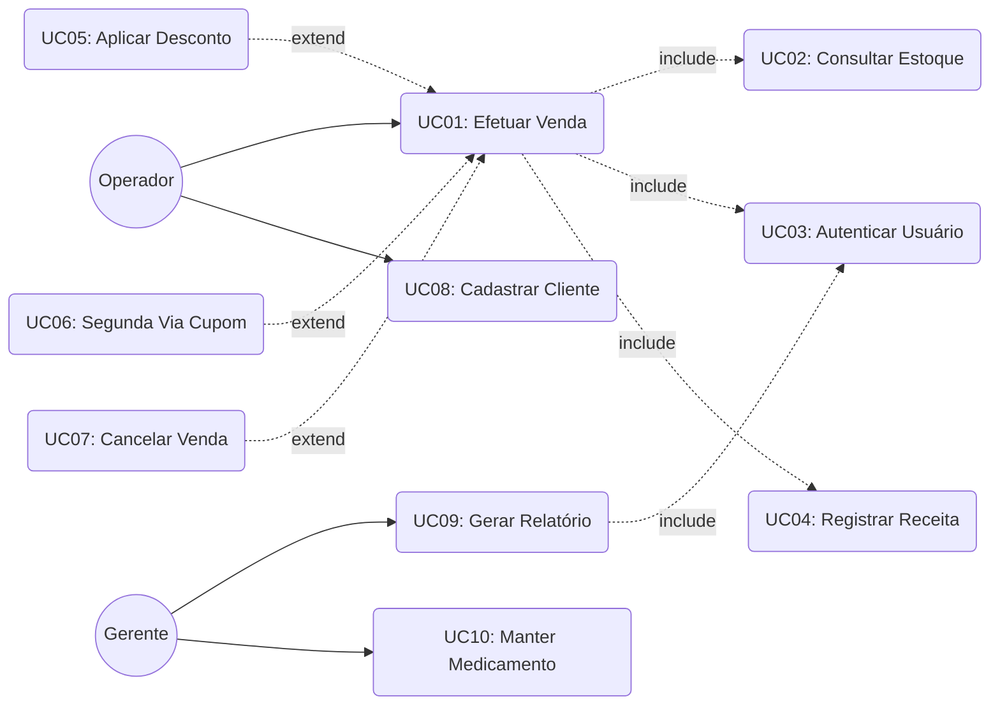

---

## 6. Documentação dos Casos de Uso

### UC01 — Efetuar Venda
* **Ator(es):** Operador de Caixa
* **Descrição:** Registrar os itens desejados pelo cliente, calcular o total e processar o pagamento.
* **Pré-condições:** Operador logado no sistema e caixa com status "Aberto".
* **Pós-condições:** Venda concluída, pagamento registrado e estoque baixado.
* **Fluxo Principal:** 1. Operador inicia nova venda.
  2. Operador bipa o código de barras do produto.
  3. Sistema consulta estoque.
  4. Operador finaliza a listagem de itens.
  5. Operador seleciona forma de pagamento.
  6. Sistema emite cupom fiscal.
* **Fluxos Alternativos / Exceções:** * FA01 — Produto controlado: Sistema pausa a venda e exige preenchimento da receita.
  * FA02 — Produto sem estoque: Sistema bloqueia a adição do item ao carrinho.
* **Relacionamentos:**
  * Include: UC02, UC03, UC04
  * Extend: UC05, UC06, UC07
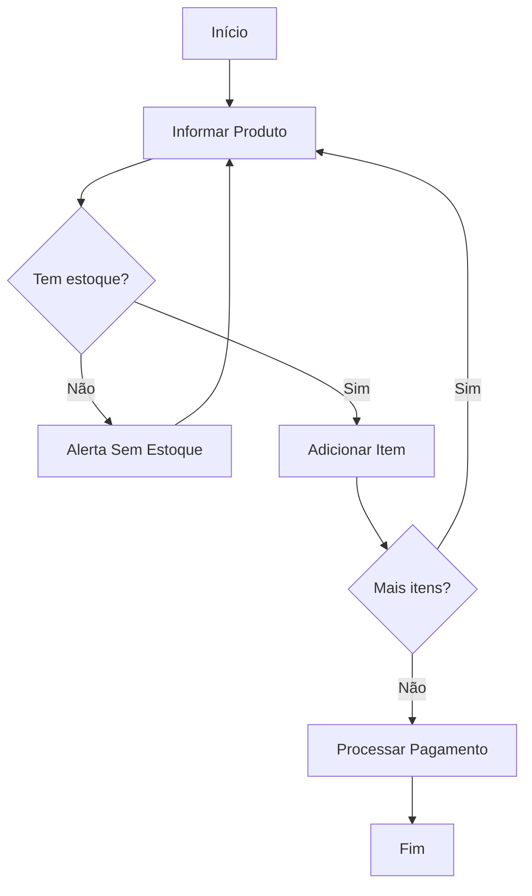

### UC02 — Consultar Estoque
* **Ator(es):** Sistema
* **Descrição:** Verifica no banco de dados se a quantidade física solicitada está disponível.
* **Pré-condições:** Um código de produto deve ser submetido ao sistema.
* **Pós-condições:** Confirmação de disponibilidade ou erro de quantidade.
* **Fluxo Principal:**
  1. Sistema recebe o ID do produto.
  2. Sistema faz leitura na tabela de inventário.
  3. Sistema retorna saldo atual.
* **Fluxos Alternativos / Exceções:**
  * FA01 — Banco de dados offline: Sistema informa "Erro de conexão ao inventário".
* **Relacionamentos:**
  * Include: (Invocado por UC01)
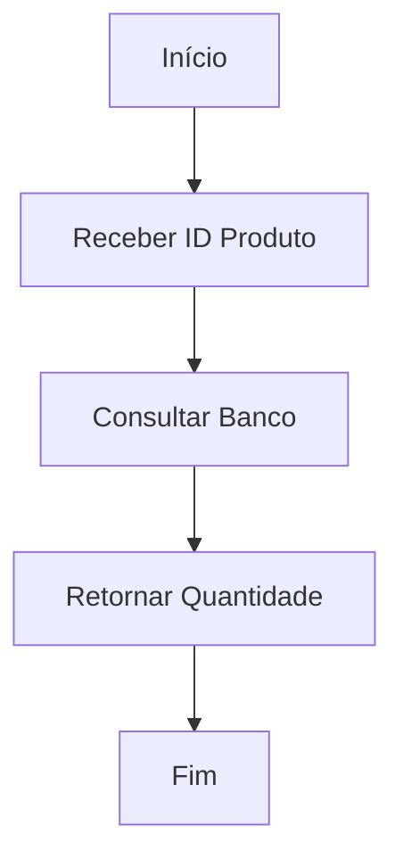

### UC03 — Autenticar Usuário
* **Ator(es):** Operador / Gerente
* **Descrição:** Valida as credenciais de acesso para garantir a segurança da operação.
* **Pré-condições:** Usuário deve possuir cadastro ativo.
* **Pós-condições:** Sessão iniciada com permissões adequadas ao perfil.
* **Fluxo Principal:**
  1. Usuário informa login e senha.
  2. Sistema criptografa e valida dados.
  3. Sistema libera acesso à tela principal.
* **Fluxos Alternativos / Exceções:**
  * FA01 — Senha incorreta: Sistema exibe mensagem de erro e limpa os campos.
* **Relacionamentos:**
  * Include: (Invocado por UC01 e UC09)
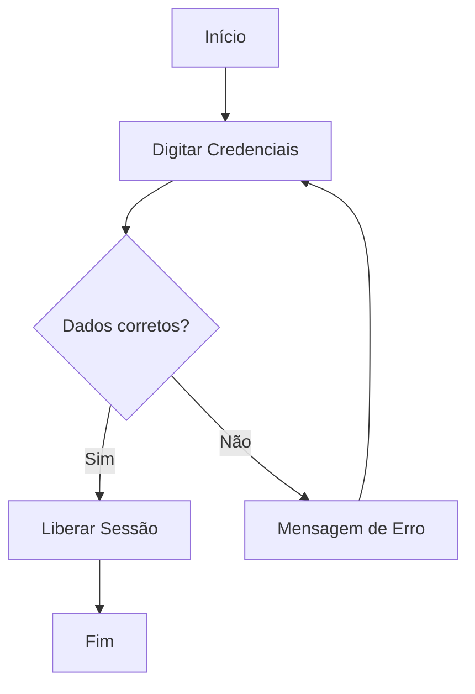

### UC04 — Registrar Receita Médica
* **Ator(es):** Operador
* **Descrição:** Coleta dados obrigatórios (CRM e nome do médico) para liberar venda de medicamentos controlados.
* **Pré-condições:** Medicamento de tarja preta/vermelha adicionado ao carrinho.
* **Pós-condições:** Receita validada e atrelada ao ID da venda.
* **Fluxo Principal:**
  1. Sistema abre formulário de receituário.
  2. Operador digita UF e CRM do médico.
  3. Operador confirma os dados do paciente.
  4. Sistema atrela os dados à transação atual.
* **Fluxos Alternativos / Exceções:**
  * FA01 — CRM em formato inválido: Sistema bloqueia o avanço da tela.
* **Relacionamentos:**
  * Include: (Invocado por UC01)
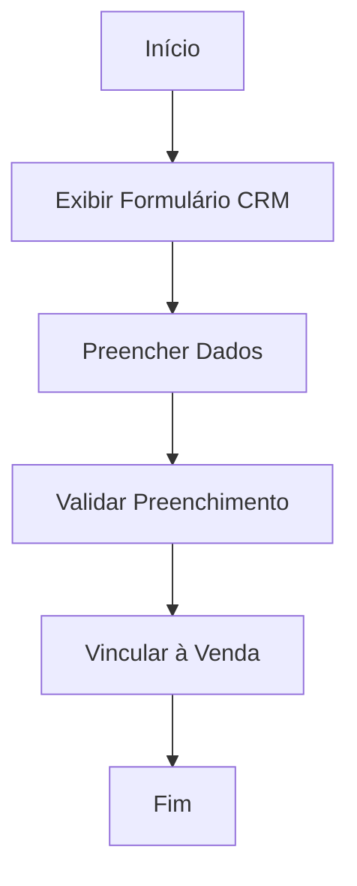

### UC05 — Aplicar Desconto Fidelidade
* **Ator(es):** Operador
* **Descrição:** Aplica uma redução de 10% no valor de itens genéricos para clientes cadastrados.
* **Pré-condições:** Cliente deve ser identificado por CPF no início da compra.
* **Pós-condições:** Valor total da venda recalculado.
* **Fluxo Principal:**
  1. Operador informa o CPF do cliente.
  2. Sistema detecta cadastro ativo no clube de fidelidade.
  3. Sistema aplica desconto nos itens elegíveis.
* **Fluxos Alternativos / Exceções:**
  * FA01 — CPF não encontrado: Sistema prossegue com o preço normal.
* **Relacionamentos:**
  * Extend: (Estende UC01)
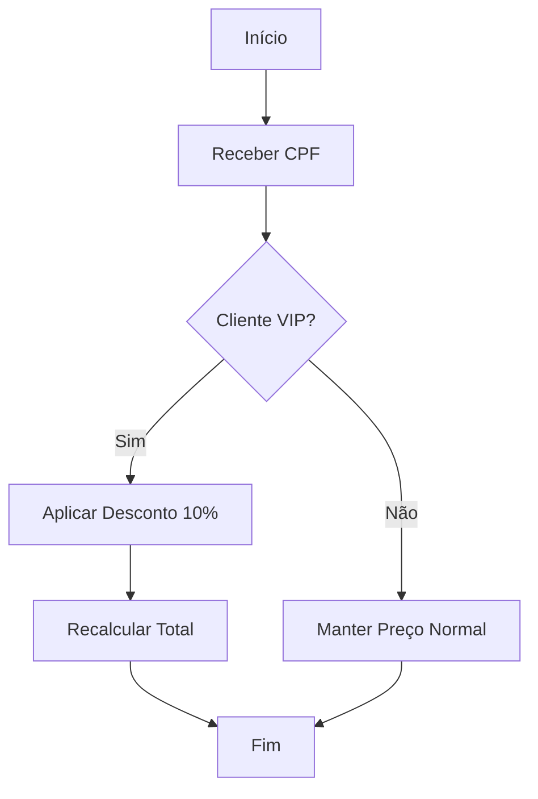

### UC06 — Emitir Segunda Via do Cupom
* **Ator(es):** Operador
* **Descrição:** Gera a reimpressão do último cupom fiscal em caso de falha da impressora ou pedido do cliente.
* **Pré-condições:** Venda ter sido finalizada com sucesso nos últimos 30 minutos.
* **Pós-condições:** Cópia idêntica do comprovante emitida em papel.
* **Fluxo Principal:**
  1. Operador clica em "Última Venda".
  2. Operador seleciona "Reimprimir Cupom".
  3. Sistema envia comando de impressão.
* **Fluxos Alternativos / Exceções:**
  * FA01 — Impressora sem papel: Sistema exibe alerta "Verifique a impressora".
* **Relacionamentos:**
  * Extend: (Estende UC01)
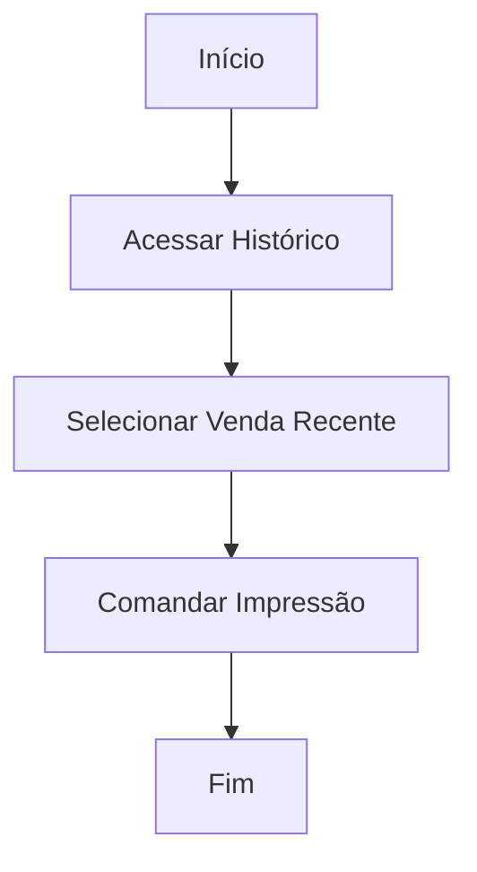

### UC07 — Cancelar Venda
* **Ator(es):** Gerente
* **Descrição:** Estorna completamente uma venda finalizada, devolvendo produtos ao estoque e dinheiro ao caixa.
* **Pré-condições:** Venda realizada a menos de 15 minutos e perfil de Gerente autenticado.
* **Pós-condições:** Transação anulada no banco de dados.
* **Fluxo Principal:**
  1. Operador aciona o botão de cancelamento.
  2. Sistema solicita credenciais do gerente.
  3. Gerente digita senha.
  4. Sistema estorna estoque e registra anulação.
* **Fluxos Alternativos / Exceções:**
  * FA01 — Prazo expirado: Sistema avisa que passou de 15 minutos e bloqueia ação.
* **Relacionamentos:**
  * Extend: (Estende UC01)
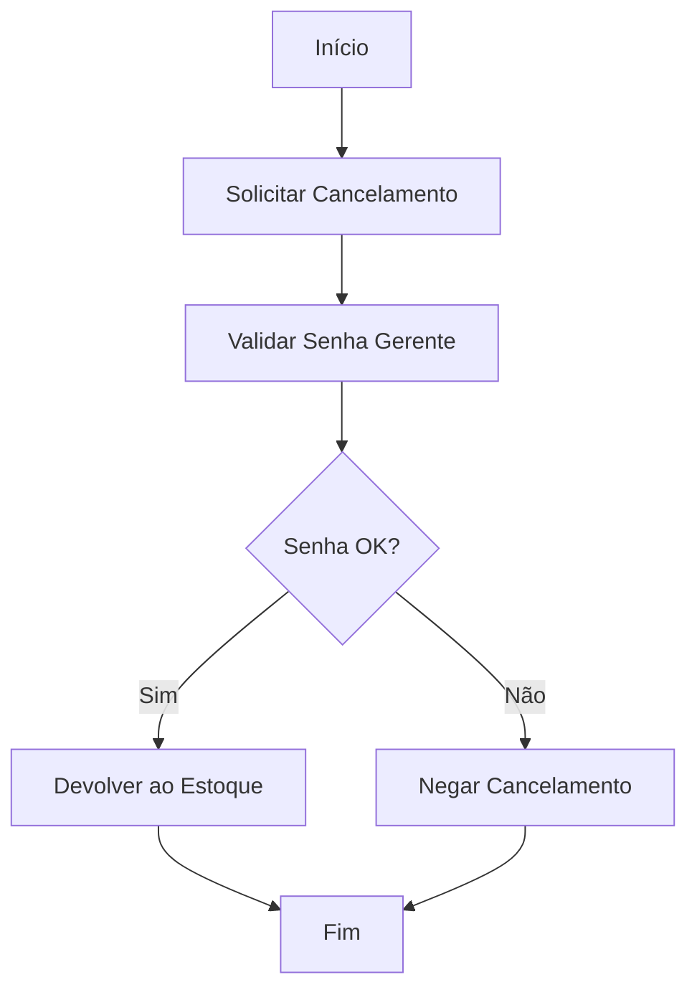

### UC08 — Cadastrar Cliente
* **Ator(es):** Operador
* **Descrição:** Insere novos clientes na base de dados para habilitar o programa de descontos.
* **Pré-condições:** Cliente fornecer número de CPF.
* **Pós-condições:** Registro salvo com sucesso no banco de dados.
* **Fluxo Principal:**
  1. Operador acessa aba de clientes.
  2. Operador insere CPF.
  3. Operador insere Nome e Telefone.
  4. Sistema salva informações.
* **Fluxos Alternativos / Exceções:**
  * FA01 — CPF já existe: Sistema exibe os dados atuais do cliente para edição.
* **Relacionamentos:**
  * Nenhum direto.
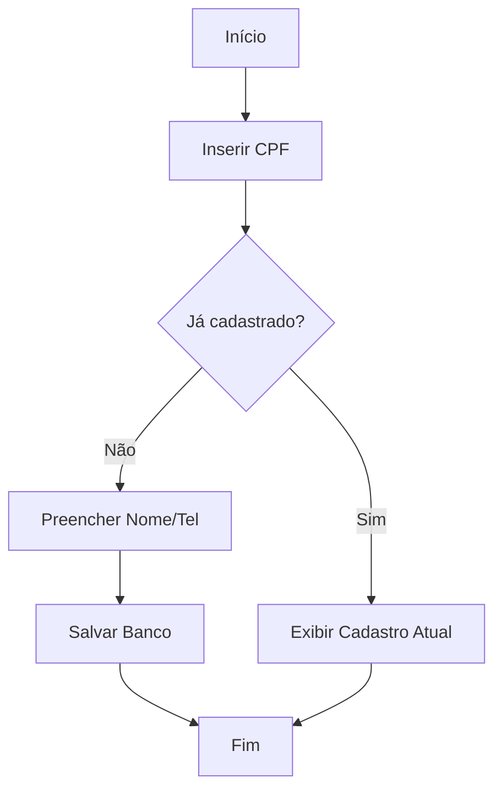

### UC09 — Gerar Relatório de Fechamento
* **Ator(es):** Gerente
* **Descrição:** Consolida o faturamento total, métodos de pagamento e movimentações do turno.
* **Pré-condições:** Operador de caixa ter encerrado o turno.
* **Pós-condições:** Relatório gerado em formato PDF.
* **Fluxo Principal:**
  1. Gerente acessa módulo financeiro.
  2. Seleciona o caixa desejado e a data.
  3. Sistema calcula as entradas e saídas.
  4. Sistema gera PDF para download.
* **Fluxos Alternativos / Exceções:**
  * FA01 — Caixa ainda aberto: Sistema avisa que o operador precisa fechar o caixa primeiro.
* **Relacionamentos:**
  * Include: UC03
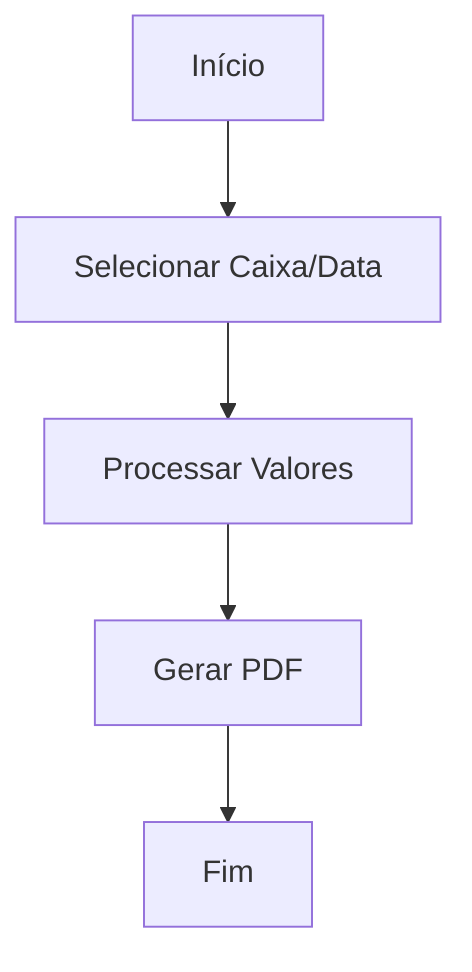

### UC10 — Manter Medicamento
* **Ator(es):** Gerente
* **Descrição:** Operação de CRUD (Criar, Ler, Atualizar, Deletar) para o catálogo de medicamentos.
* **Pré-condições:** Usuário ter perfil de gerência logado.
* **Pós-condições:** Catálogo de produtos atualizado para o PDV.
* **Fluxo Principal:**
  1. Gerente acessa aba de Estoque.
  2. Insere dados do novo medicamento (Nome, Princípio Ativo, Lote, Preço).
  3. Sistema valida dados.
  4. Sistema persiste no banco de dados.
* **Fluxos Alternativos / Exceções:**
  * FA01 — Código EAN duplicado: Sistema recusa cadastro e avisa que código de barras já existe.
* **Relacionamentos:**
  * Nenhum direto.
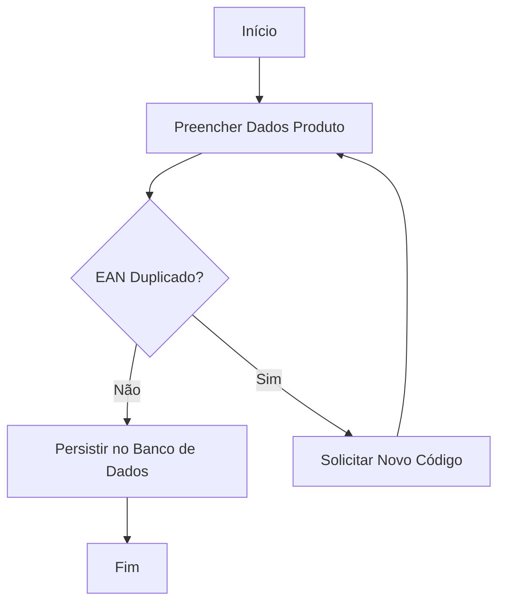
